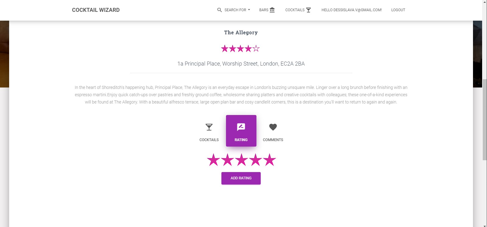
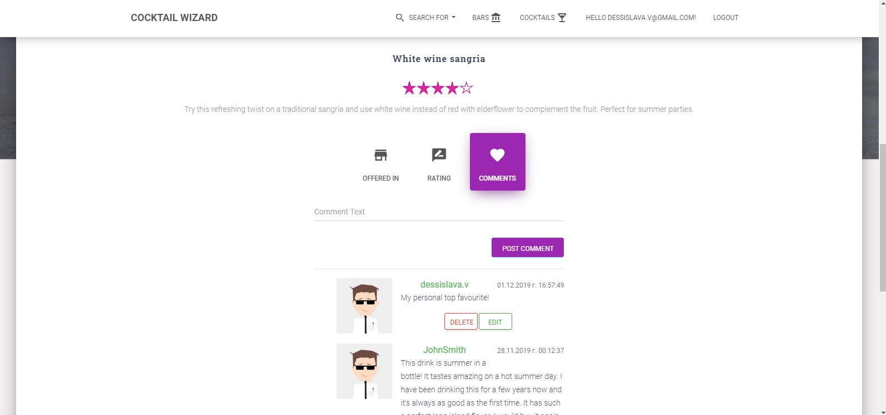

# CocktailWizard
Web application that allows creation of cocktails and follows their distribution and success in amazing bars.

## Team Members
* Radko Stanev - [GitHub](https://github.com/radkostanev)
* Dessislava Valchanova - [GitHub](https://github.com/dessislavav)

## Project Description
### Areas
* **Public part** -  accessible without authentication
* **Private part** available for registered users only
* **Administrative part** available for administrators only

#### Public Part
* The public part consists of a home page displaying top-rated bars and cocktails in separate sections on the page as well as login page and register page.

* Upon clicking a bar, the visitor can see details for the bar and the cocktails it offers

* Upon clicking a cocktail, the visitor can see details for the cocktail and the bars this cocktail is offered in

* It also includes **searching possibility** for: 
     * Bars: by Name, Address and Rating	as well as for 
     * Cocktails: by Name, Ingredient/s and Rating
     

#### Private Part

* After login, users see everything visible to website visitors and additionally they can:
     * Rate bars
     * Rate cocktails (regardless of which bar offers them)
     * Leave a comment for a bar
     * Leave a comment for a cocktail
     
     
     
     
     
     

#### Administrative Part
* Admins can:
     * Manage ingredients – CRUD operations for ingredients for cocktails
     * Manage cocktails – CRUD operations for cocktails
     * Manage bars – CRUD operations for bars
     * Set cocktails as available in particular bars 
     
* Create Cocktail Modal

* Edit Bar Modal

## Technologies
* ASP.NET Core
* ASP.NET Identity
* Entity Framework Core
* MS SQL Server
* Razor
* AJAX
* JavaScript / jQuery
* HTML
* CSS
* Bootstrap
* AppVeyor

## Notes
* Moq, InMemory and MSTest for testing
* Caching for performance optimization
* DTO (data transfer objects) used
* Server-side pagination present
* Used branches durring development ot features
* Used Azure DevOps to manage personal development tasks
* 90% Unit test code coverage of the business logic

## Database Diagram

